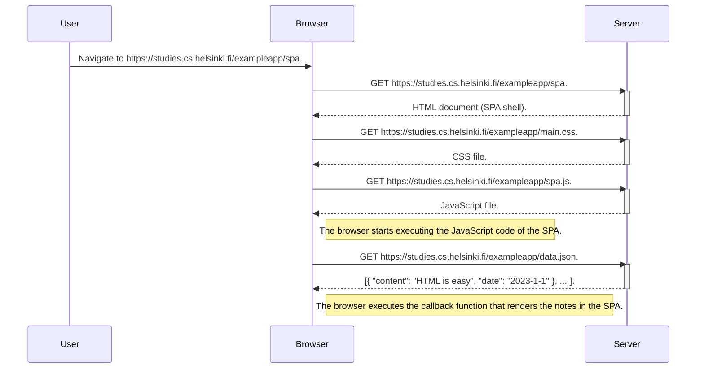

```mermaid
sequenceDiagram
    participant User
    participant Browser
    participant Server

    User->>Browser: Navigate to https://studies.cs.helsinki.fi/exampleapp/spa.
    Browser->>Server: GET https://studies.cs.helsinki.fi/exampleapp/spa.

    activate Server
    Server-->>Browser: HTML document (SPA shell).
    deactivate Server

    Browser->>Server: GET https://studies.cs.helsinki.fi/exampleapp/main.css.

    activate Server
    Server-->>Browser: CSS file.
    deactivate Server

    Browser->>Server: GET https://studies.cs.helsinki.fi/exampleapp/spa.js.

    activate Server
    Server-->>Browser: JavaScript file.
    deactivate Server

    Note right of Browser: The browser starts executing the JavaScript code of the SPA.

    Browser->>Server: GET https://studies.cs.helsinki.fi/exampleapp/data.json.

    activate Server
    Server-->>Browser: [{ "content": "HTML is easy", "date": "2023-1-1" }, ... ].
    deactivate Server

    Note right of Browser: The browser executes the callback function that renders the notes in the SPA.

```
