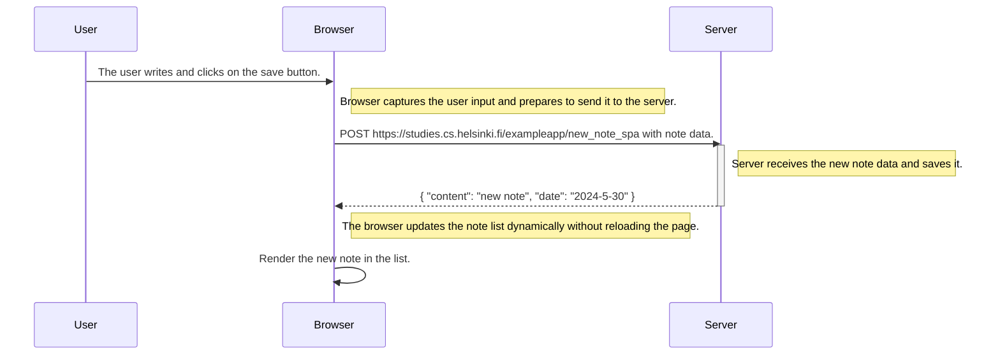

```mermaid
sequenceDiagram
    participant User
    participant Browser
    participant Server

    User->>Browser: The user writes and clicks on the save button.

    Note right of Browser: Browser captures the user input and prepares to send it to the server.

    Browser->>Server: POST https://studies.cs.helsinki.fi/exampleapp/new_note_spa with note data.

    activate Server
    Note right of Server: Server receives the new note data and saves it.
    Server-->>Browser: { "content": "new note", "date": "2024-5-30" }
    deactivate Server

    Note right of Browser: The browser updates the note list dynamically without reloading the page.

    Browser->>Browser: Render the new note in the list.

```